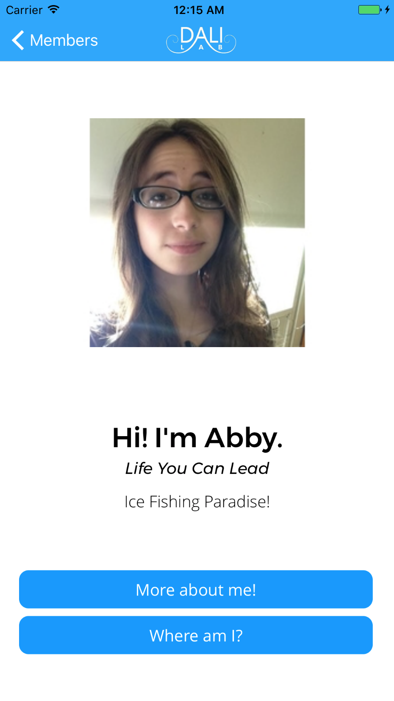
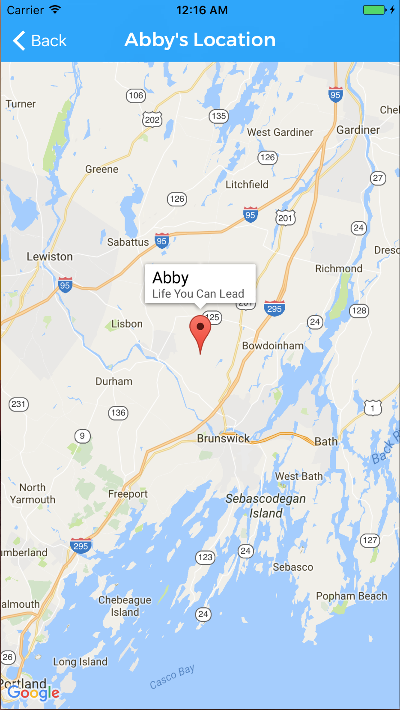
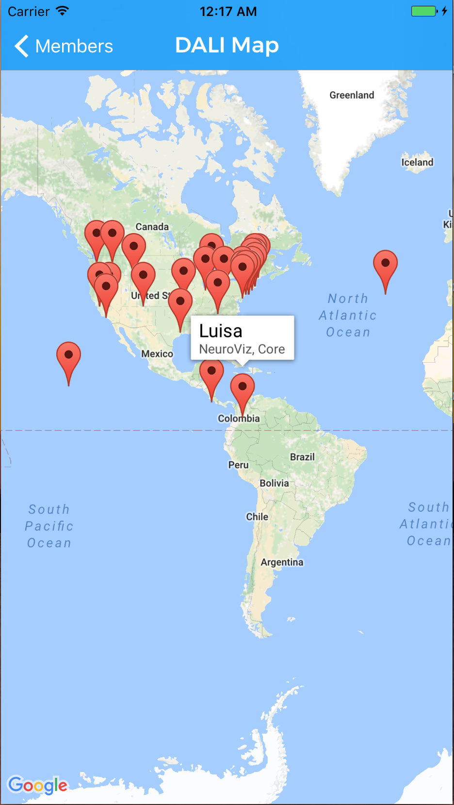
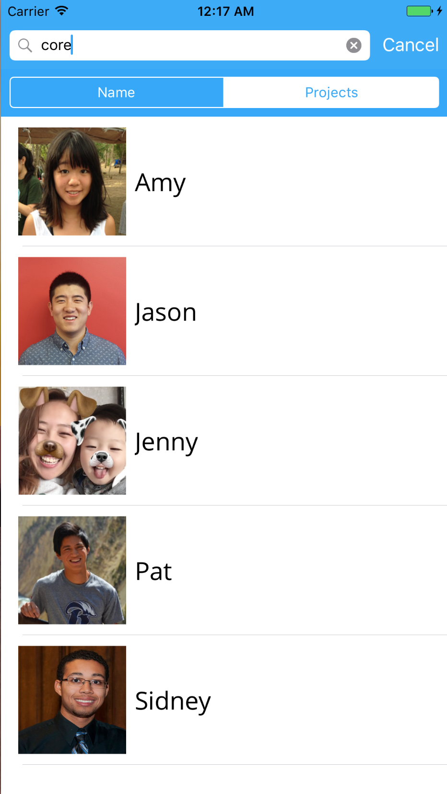

# DALI Application: A Dashboard for the DALI Lab
### Features

The DALI App is dashboard that stores information from the members of the DALI Lab including name, projects, personal websites,
and a short message. The user can search members by name or by project/position i.e. NeuroViz, Core, Staff etc. Each member has
a profile page where their information is displayed. The user can visit the selected user's personal website and see their location
on a map. In addition, there is a map that features all of the DALI Lab members, their chosen location, and their project/position.

### How it was built

The DALI App was built using Firebase, an online database platform created by Google, and Google Maps' iOS SDK. The member data provided
by DALI was stored in Firebase and then parsed and from that data, the latitude and longitude coordinates where used as input in for the
Google Maps portion of the app.

### Instructions

`pod install` in DALI App's directory. 
`DALIApp.xcworkspace` should be used.
